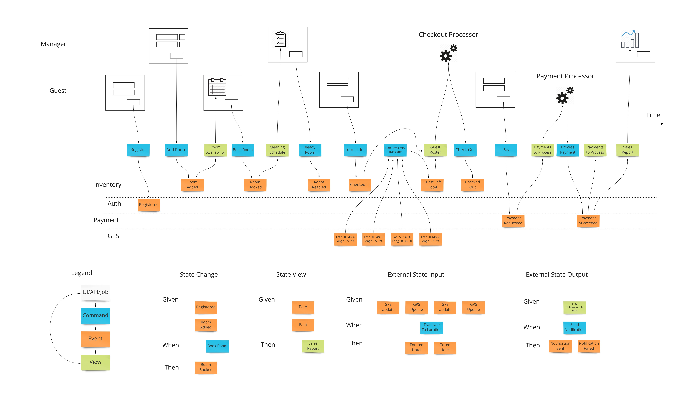

Resource for compiling tools necessary to make event modeling as good as it can be

If you want to read up on what event modeling is read this [article](https://eventmodeling.org/posts/what-is-event-modeling/)

Currently, event modeling is primarily used to describe user and system interactions. It is a great tool for requirement gathering and domain modeling. I see great potential in test specifications, scenario previewing, and snapshot views of different scope of the project and systems. I think that event modeling is a very intuitive way to think about design and has the potential to clarify even the structure of code in a project. I think we can put it to the test as an alternative form of documentation (good documentation can be hard to come by). I even want to try out showing an event model as a form of demonstrating setup instruction or bug reproducer.

The diagram shown below is a fairly thorough template of what event modeling would look like. I might even play around with making it vertical instead of horizontal.



That style of left to right representation of events unfolding horizontally in a timeline make sense as if you're watching a movie with sliding frame and animation. Would be even better if you have a sliding frame with an electron lighting up to indicate how time is moving forward and what is happening at a given time. 

What if you don't have a sliding frame? Imagine you have a long workflow/process that calls upon many many things, does it make sense to have a diagram that goes from left to right to infinity? Not really, if you're looking at a static frame, it might make more sense to read chart or text from top to bottom. What kind of physical medium would that look like in current day (02/21/2021)? I suspect that a comic book or old fashion 8mm film still frames would be a good visual representation that goes from top to bottom, and a stage play would be a good text representation for how events unfold in a format that goes from top to bottom (referencing the stage_play_sample.pdf as an example).

The syntax I'm following is anything inside () is an event. Statements that announce a request are commands. Statements that announce a response are responses.

-----------

A Converter Story

**Cast of Actors**:

Users: 
  - Designers: People who design document templates

Systems:
  - Reporting: System that renders DocumentTemplates into DocumentPdfs
  - Converter: System that converts OldDocumentDataFormat reference to NewDocumentDataFormat in DocumentTemplates
  - Repository: System that stores document DocumentTemplates
  - Data Provider: System that provides data relevant for DocumentTemplates
  - Validator: System that validates if DocumentTemplates produce the the same pdf

DataTypes:
  - DocumentTemplate: Document Template that gets transformed to PDF
  - DocumentPdf: Output PDF of document to sell to customers
  - OldDocumentDataFormat: The old json scheme of the data format
  - NewDocumentDataFormat: The new json scheme of the data format
  - SubstitutionRule: Rules for substitution of specific fields and values provided by the data provider

Setting: We are in the office where the underlying data format provided by Data Provider has changed, thereby changing how the DocumentTemplate needs to define its DocumentData. We want a system that can convert all existing DocumentTemplates' reference of OldDocumentDataFormat the NewDocumentDataFormat that the Data Provider is going to move to and also ensure that the DocumentPdf that get rendered is still correct. 

Scope: Ecosystem

Scenario 1: A successful conversion

```
Script Start============================================================

Designer: 
  - Converter, request convert awesomeJson:DocumentTemplate massEffect1:OldDocumentDataFormat massEffect2:NewDocumentDataFormat
Converter: 
  - (convert request recieved from Designer)
  - Data Provider, request getSubstitutionRule massEffect1:OldDocumentDataFormat massEffect2:NewDocumentDataFormat
Data Provider: 
  - (getSubstitutionRule request received from Converter)
  - Converter, getSubstitutionRule response is massEffectRule:SubstitutionRule
Converter: 
  - (getSubstitutionRule response massEffectRule:SubstitutionRule received from Data Provider)
  - (apply massEffectRule:SubstitutionRule to awesomeJson:DocumentTemplate)
  - Reporting, request render awesomeJson:DocumentTemplate
Reporting: 
  - (render request received from Converter)
  - Converter, render response is awesomePdf:DocumentPdf
Converter: 
  - (render response awesomePdf:DocumentPdf received from Reporting)
  - Validator, request compare awesomePdf:DocumentPdf awesomePdfReference:DocumentPdf
Validator: 
  - (compare request received from Converter)
  - Converter, compare response is "Success"
Converter: 
  - (compare response "Success" received from Validator)
  - Repository, request store awesomeJson:DocumentTemplate
Repository: 
  - (store request received from Converter)
  - Converter, store response is "Success"
Converter: 
  - (store response "Success" received from Repository)
  - Designer, convert response is "Success"
Designer: 
  - (convert response received from Converter)

Script End============================================================
```

What's cool about this way of defining the system's workflow and scenarios is that you can create tools that filter based on the perspectives. Say for example, I want to only see the perspective of the Converter, this would be the result:

```
Script Start============================================================
..
..
Converter: 
  - (convert request recieved from Designer)
  - Data Provider, request getSubstitutionRule massEffect1:OldDocumentDataFormat massEffect2:NewDocumentDataFormat
  - (getSubstitutionRule response massEffectRule:SubstitutionRule received from Data Provider)
  - (apply massEffectRule:SubstitutionRule to awesomeJson:DocumentTemplate)
  - Reporting, request render awesomeJson:DocumentTemplate
  - (render response awesomePdf:DocumentPdf received from Reporting)
  - Validator, request compare awesomePdf:DocumentPdf awesomePdfReference:DocumentPdf
  - (compare response "Success" received from Validator)
  - Repository, request store awesomeJson:DocumentTemplate
  - (store response "Success" received from Repository)
  - Designer, convert response is "Success"
..
..
Script End============================================================
```

The double dots represent that there are other events happening before and after Converter action

I can do the same for the other systems and define what their roles are meant to be, make them pass simulated or real Scenario 1 workflows and have good specifications for independent teams to work on (the huge attraction of event modeling). 

Based on the full definition above, this is what the event model stage play would look like from the perspective of Designer and Repository, respectively, and together

```
Script Start============================================================

Designer: 
  - Converter, request convert awesomeJson:DocumentTemplate massEffect1:OldDocumentDataFormat massEffect2:NewDocumentDataFormat
  - (convert response received from Converter)

Script End============================================================
```

```
Script Start============================================================

Repository: 
  - (store request received from Converter)
  - Converter, store response is "Success"

Script End============================================================
```

```
Script Start============================================================

Designer: 
  - Converter, request convert awesomeJson:DocumentTemplate massEffect1:OldDocumentDataFormat massEffect2:NewDocumentDataFormat
..
..
Repository: 
  - (store request received from Converter)
  - Converter, store response is "Success"
..
..
Designer: 
  - (convert response received from Converter)

Script End============================================================
```

This is a great way for a designer to see different scopes of how the system interacts
